# OfflineOrbit_V28

> **Offline-first, bilingual digital learning for Class 4 classrooms**

OfflineOrbit is a **Progressive Web App (PWA)** designed for primary-school classrooms where internet access is unreliable or unavailable. It provides an interactive learning experience in **English and Hindi**, stores learning progress locally, and gives teachers a classroom analytics board — without requiring a backend, cloud database, or continuous internet connection.

The project is built around a simple idea:

**Offline is the default. Internet is optional.**

---

## Table of Contents

- [Overview](#overview)
- [Problem Statement](#problem-statement)
- [Proposed Solution](#proposed-solution)
- [Key Features](#key-features)
- [Screenshots](#screenshots)
- [System Architecture](#system-architecture)
- [Technology Stack](#technology-stack)
- [Application Flow](#application-flow)
- [Data Model](#data-model)
- [Project Structure](#project-structure)
- [Offline-First Design](#offline-first-design)
- [Student Experience](#student-experience)
- [Teacher Experience](#teacher-experience)
- [Data Safety and Backup](#data-safety-and-backup)
- [Optional Online Sync](#optional-online-sync)
- [Accessibility](#accessibility)
- [Lessons Included](#lessons-included)
- [Installation and Running](#installation-and-running)
- [Build and Deployment](#build-and-deployment)
- [Architecture Decisions](#architecture-decisions)
- [Limitations](#limitations)
- [Future Extensions](#future-extensions)
- [Feasibility and Viability](#feasibility-and-viability)
- [Benefits](#benefits)
- [Conclusion](#conclusion)

---

## Overview

OfflineOrbit is a lightweight, browser-based learning platform created for **low-connectivity and low-resource classrooms**.

The application combines:

- Offline-first PWA functionality
- Bilingual English/Hindi content
- Identity-less student login
- Local progress tracking
- Interactive lessons
- Adaptive quizzes
- Retry-until-correct practice
- Hints and hint-effectiveness analytics
- Partial-credit scoring
- Review mode
- Offline text-to-speech
- Printable practice worksheets
- Student progress dashboard
- Class leaderboard
- Teacher analytics
- Weak-spot detection
- Topic grouping
- Assignments and homework tracking
- Same-device live teacher updates
- "I'm Stuck" / Raise-Hand signalling
- CSV/PDF export
- Backup, restore and merge
- Optional online synchronization
- Accessibility settings

The project is intentionally implemented with browser-native technologies so that the core learning experience can continue working even when the network is switched off.

---

## Problem Statement

Many primary-school classrooms, particularly in rural and semi-urban environments, can face:

- Unreliable or absent internet connectivity
- Shared low-specification tablets or laptops
- Language barriers for English-only digital content
- Limited IT support and infrastructure budgets
- High teacher-to-student workload
- Limited visibility into *how* students are struggling
- Risk of losing locally stored learning progress
- Accessibility requirements that are not addressed by many lightweight learning tools

A cloud-first learning application can become difficult to use when connectivity is unavailable. OfflineOrbit instead treats the absence of internet as a normal operating condition.

---

## Proposed Solution

OfflineOrbit is designed as an **offline-first digital learning platform** that can be installed and used as a Progressive Web App (PWA). The real solution is designed around the practical constraints of low-connectivity classrooms: learning should continue even when the internet is unavailable, content should be understandable in the learner's preferred language, teachers should still be able to monitor progress locally, and the application should remain usable on low-end shared devices.

The full solution is built around five pillars:

### 1. Offline-first mobile and web app

Core lessons, quizzes, progress tracking and classroom features remain accessible without an active internet connection after the application has been loaded/installed.

OfflineOrbit uses a **Service Worker and Cache Storage** to keep the application shell and lesson assets available offline, while **IndexedDB** stores learning progress locally.

The goal is not simply to cache a few pages or videos. The core learning loop itself is designed to continue working offline.

### 2. Interactive lessons in local languages

Lessons are designed to be interactive rather than passive content.

OfflineOrbit currently demonstrates **English + Hindi** content in the same application. Language can be switched without reloading the lesson, allowing students to learn in a familiar language while retaining access to English.

The prototype uses bilingual lesson blocks, interactive questions, hints, retry-based practice and read-aloud support.

### 3. Digital literacy modules

The broader solution is intended to support students who have little or no previous exposure to digital devices.

The interface therefore uses a simple login, clear navigation, large touch-friendly controls, visual lesson content and accessibility options.

In the current prototype, this is represented through the simplified onboarding/login experience and accessible student interface. A dedicated standalone digital-literacy curriculum is **not yet implemented as a separate lesson module** in this prototype.

### 4. Teacher dashboards

The solution gives teachers visibility into student learning even when the school is offline.

The Teacher Board reads the same locally stored progress data used by the student experience and provides:

- Student and lesson progress
- Weak-spot detection
- Topic-based student grouping
- Assignment tracking
- Raised-hand / "I'm Stuck" signals
- Hint-effectiveness information
- Leaderboard information
- CSV/PDF export
- Backup and restore

When internet connectivity becomes available, an **optional explicit Sync now** action can send unsynced records to a configured HTTP endpoint.

### 5. Low-end device optimisation

The application is deliberately built with lightweight browser-native technologies rather than a large frontend framework.

The prototype uses:

- Vanilla JavaScript
- HTML5
- CSS3
- Service Worker
- IndexedDB
- localStorage
- BroadcastChannel
- Web Speech API
- Web App Manifest

This keeps the application lightweight and avoids requiring continuous cloud connectivity or a dedicated backend.

---

# What We Are Doing in This Prototype

The current OfflineOrbit prototype is a **working proof of the proposed solution**, focused on demonstrating the complete offline learning and classroom-management loop rather than implementing every possible future extension.

The prototype currently targets **Class 4** and contains five interactive bilingual lessons:

| Subject | Prototype Content |
|---|---|
| Mathematics | Whole Numbers |
| Mathematics | Fractions |
| Mathematics | Basic Geometry |
| EVS / Science | Plants Around Us |
| EVS / Science | States of Matter |

### Prototype implementation

The prototype demonstrates the following real solution components:

**Offline learning**

The application can operate without continuous internet after the initial application assets have been loaded. The Service Worker caches the application shell and lesson resources.

**Bilingual learning**

The prototype provides English and Hindi versions of the lesson interface and content.

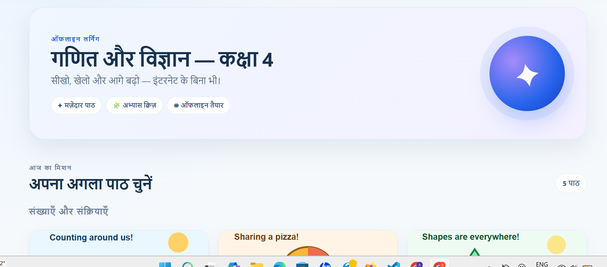

**Simple student onboarding**

Students enter their name and class ID instead of creating an email/password account.

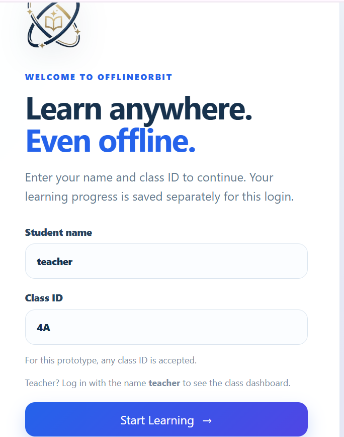

**Interactive lessons**

Students can open lessons containing explanatory content, visuals and interactive learning elements.

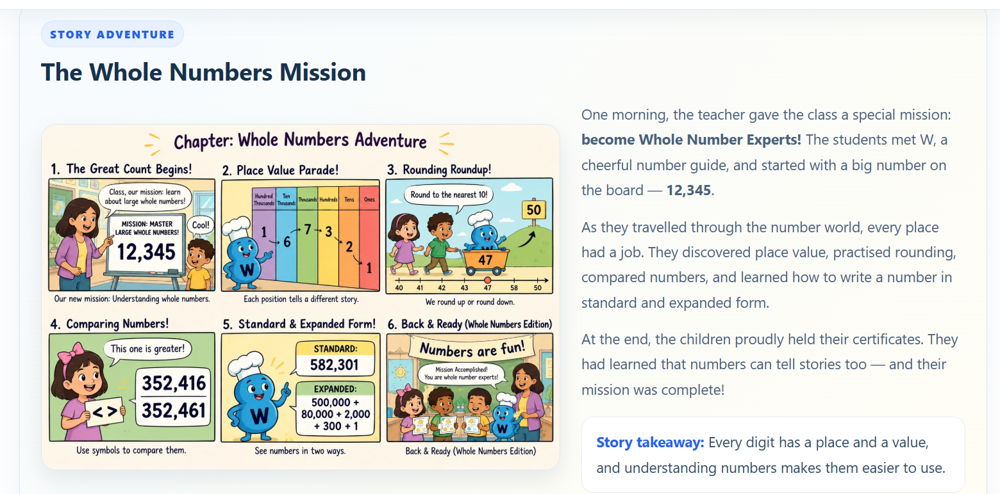

**Bilingual lesson switching**

Students can switch between English and Hindi within the learning experience.

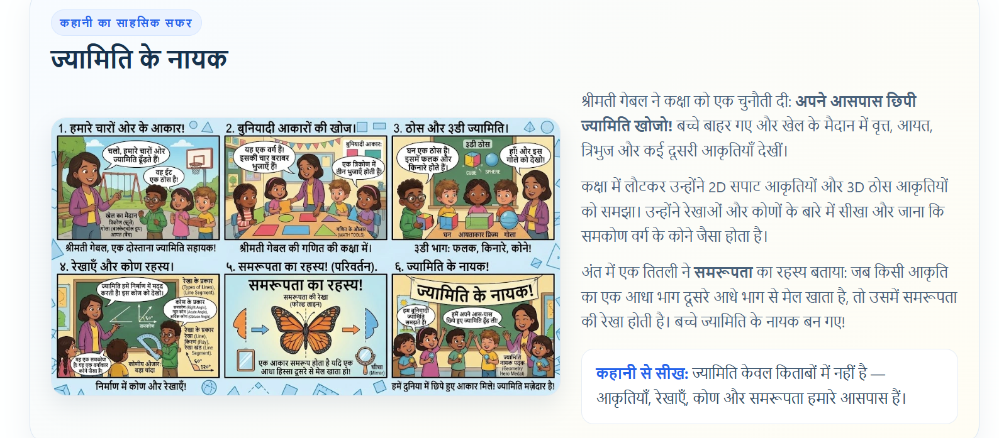

**Interactive quizzes**

The prototype includes quiz questions with retry-until-correct behaviour.

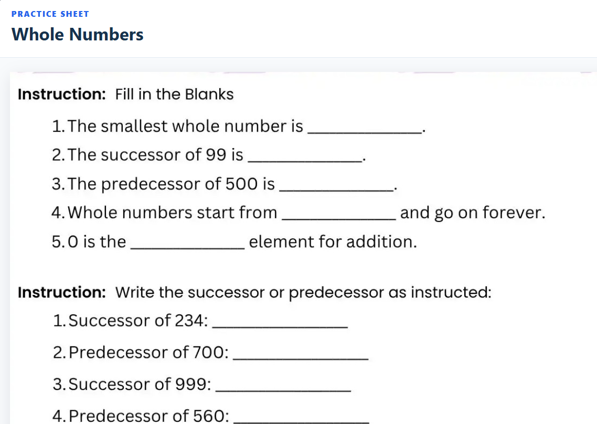

**Hints and adaptive attempts**

Wrong answers can trigger remedial hints, while additional attempts are recorded for scoring and analytics.

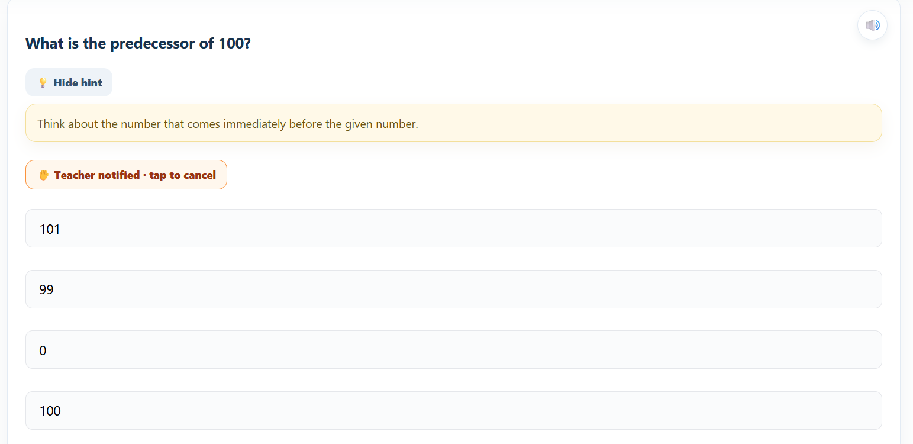

**Read-aloud and lesson tools**

The prototype provides browser-based read-aloud functionality and lesson tools intended to support younger and struggling readers.

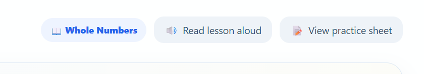

**Accessibility**

The prototype includes larger touch targets, high-contrast mode and dyslexia-friendly reading options.

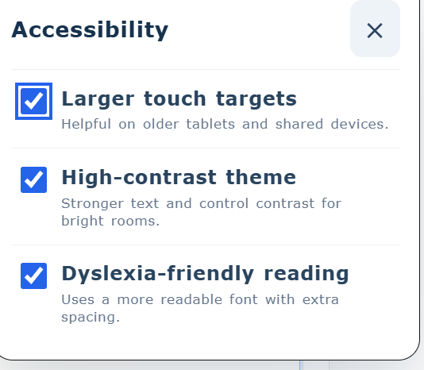

**Student progress**

Each student's progress is stored locally and can be displayed through the student dashboard.

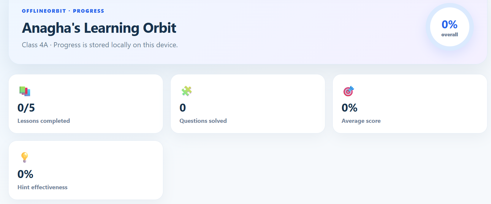

**Classroom leaderboard**

The prototype aggregates locally stored student progress into a classroom leaderboard.

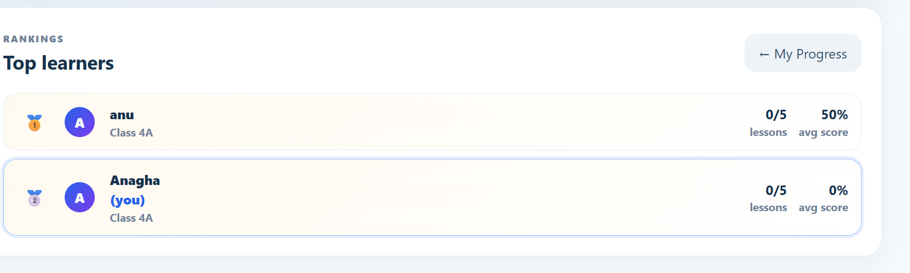

**Teacher analytics**

The Teacher Board provides a classroom-level view of student and lesson progress.

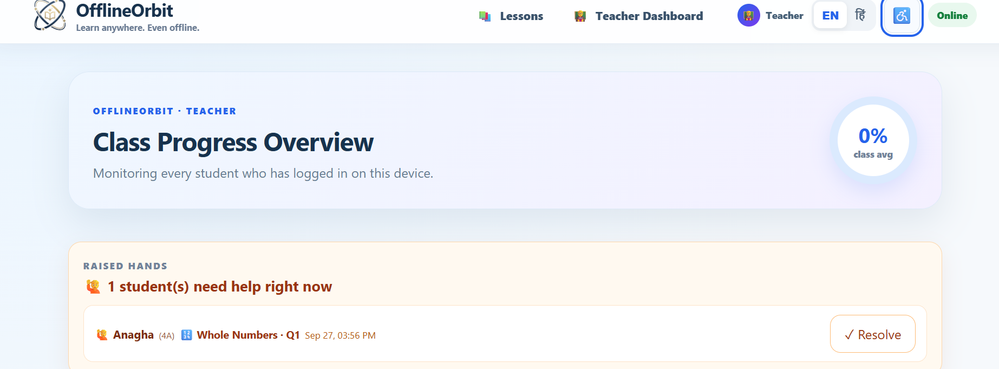

**Weak-spot detection**

The prototype analyses question-level results to help identify questions where students struggled on their first attempt.

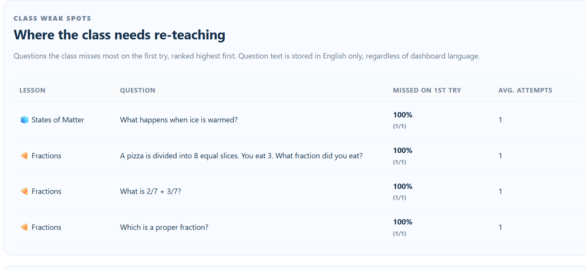

**Topic grouping and data safety**

The Teacher Board includes student grouping and data-safety controls such as backup/restore.

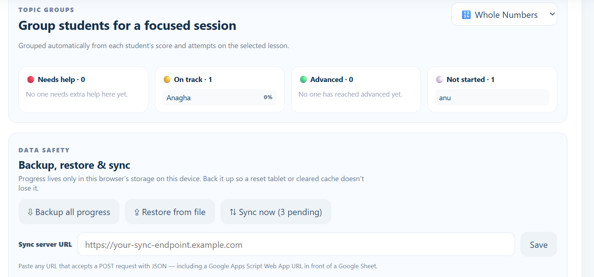

**Same-device live updates**

The prototype uses BroadcastChannel to demonstrate live updates between student and teacher tabs on the same physical device.

**Raise-Hand / "I'm Stuck"**

Students can signal that they need help on a particular question, allowing the teacher to see the request from the Teacher Board.

**Backup and restore**

The prototype can export locally stored progress as a JSON backup and restore it later, protecting learning records from browser/device resets.

**Optional synchronization**

The prototype also includes the foundation for explicit online synchronization when connectivity is available. This is optional and does not replace the offline learning workflow.

---

## Prototype-to-Solution Mapping

| Proposed Solution Pillar | What the Prototype Demonstrates |
|---|---|
| Offline-first mobile/web app | PWA shell, Service Worker caching, IndexedDB-based local progress |
| Interactive local-language lessons | English/Hindi lessons, interactive quizzes, hints and review |
| Digital literacy | Simplified login, guided navigation and accessible touch-oriented UI; dedicated digital-literacy lessons remain a future content extension |
| Teacher dashboards | Teacher Board, weak spots, topic groups, assignments, raised hands and exports |
| Low-end device optimisation | Lightweight Vanilla JS architecture and browser-native APIs |
| Progress synchronization | Local-first progress with optional explicit online sync |
| Data protection | JSON backup, restore and timestamp-based merge |
| Accessibility | Larger touch targets, high contrast, dyslexia-friendly mode and read-aloud |

---

## Current Prototype Scope vs Full Solution

The **full proposed solution** is the broader product vision for deployment in low-connectivity schools.

The **current prototype** proves the most important technical and classroom workflows:

```text
Student Login
      ↓
Bilingual Syllabus
      ↓
Interactive Lesson
      ↓
Quiz + Hint + Retry
      ↓
Local Progress
      ↓
Student Dashboard
      ↓
Teacher Board
      ↓
Weak Spots / Groups / Assignments
      ↓
Backup / Restore / Optional Sync
```

This means the prototype is not just a static UI demonstration. It implements the core offline learning, local progress and teacher-analytics loop needed to demonstrate how the proposed solution would work in practice.


# Key Features

## 1. Offline-First PWA

The application shell and lesson assets are cached by a Service Worker.

Once the initial load has been completed, the core application can continue working without an active internet connection.

**Technology:** Service Worker, Cache Storage, Fetch API, Web App Manifest.

---

## 2. Bilingual English / Hindi Experience

English and Hindi content are stored together in the lesson HTML using language-specific blocks.

The language can be switched without reloading the lesson.

### Example

```html
<div data-lang="en">
  Whole Numbers
</div>

<div data-lang="hi">
  पूर्ण संख्याएँ
</div>
```

The application simply shows the active language block.


---

## 3. Simple Student Login

Students do not need:

- Email accounts
- Passwords
- Cloud accounts
- Server-side authentication

The login uses:

- Student name
- Class ID

A local student ID is generated from the two values.

Example:

```text
Anagha + 4A
        ↓
anagha::4a
```

This ID is used to keep each student's progress separate on the same device.

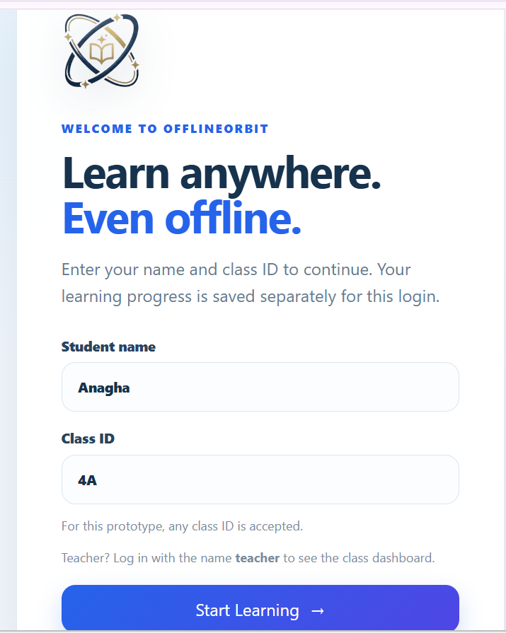

---

## 4. Teacher Login and Teacher Board

Entering the name **teacher** activates the teacher experience.

The teacher can access classroom-level information such as:

- Student progress
- Lesson completion
- Scores
- Weak spots
- Topic groups
- Assignments
- Raised hands
- Hint effectiveness
- Leaderboard
- Data safety
- CSV/PDF export


---

## 5. Syllabus View

Students can browse the available lessons from a simple syllabus screen.

The current prototype groups content into:

- Mathematics
- Science / EVS

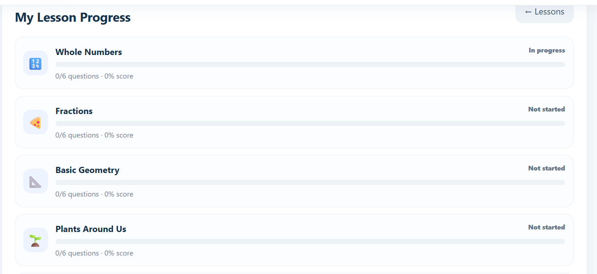

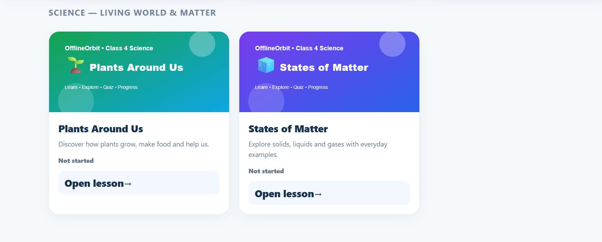

---

## 6. Interactive Bilingual Lessons

Lessons are packaged as self-contained HTML fragments.

Each lesson can contain:

- Explanatory content
- Illustrations
- Questions
- Options
- Hints
- Read-aloud controls
- Review mode
- Practice-sheet generation


---

## 7. Adaptive Quiz and Retry-Until-Correct

Students are not simply stopped after selecting a wrong answer.

The quiz flow is:

```text
Question
   ↓
Student selects an option
   ↓
Wrong?
   ├── Show remedial hint
   ├── Disable that wrong option
   └── Allow another attempt
   ↓
Correct?
   └── Save score + attempts + question details
```

The score decreases with retries but has a defined floor.


---

## 8. Bilingual Hint System

Hints are available for quiz questions.

The system records:

- Whether a hint was opened
- Which question it was used on
- What happened on the next attempt

A hint is considered effective when the next answer attempt after opening it is correct.

This information is aggregated for the Teacher Board.

---

## 9. Partial-Credit Grading

OfflineOrbit records the attempt number required to answer a question correctly.

The project report defines the following credit model:

| Correct on | Credit |
|---|---:|
| First attempt | 100% |
| Second attempt | 75% |
| Third attempt | 50% |
| Fourth or later | 25% |

The individual question values are combined into a lesson-level score.

---

## 10. Review Mode

If a student needed multiple attempts on questions, the lesson can offer:

**Practice the ones I got wrong**

This creates a focused practice view containing the questions that required additional attempts.

The student can return to the full lesson afterward.

---

## 11. Offline Read-Aloud

OfflineOrbit uses the browser's **Web Speech API**.

The read-aloud system can use:

- English voices
- Hindi (`hi-IN`) voices

The feature does not require audio files or a cloud TTS server.


---

## 12. Printable Practice Worksheets

A lesson can generate a clean practice worksheet.

The worksheet can then be:

- Printed
- Saved as PDF

The browser's native print functionality is used, so no server-side PDF generator is required.

---

## 13. Student Progress Dashboard

Students can see their own learning progress.

The dashboard can show:

- Lessons completed
- Scores
- Attempts
- Homework
- Leaderboard access


---

## 14. Class Leaderboard

The leaderboard is generated from locally stored student progress.

The documented ranking logic considers:

1. Lessons completed
2. Average score

The leaderboard is designed as a contained, same-device classroom feature.


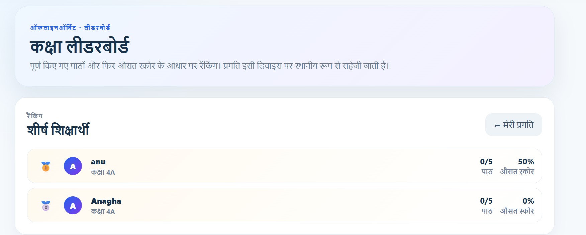

---

## 15. Teacher Class Analytics

The Teacher Board aggregates records for all students stored on the device.

It can show:

- Class totals
- Per-student results
- Per-lesson results
- Attention indicators
- Assignments
- Weak spots
- Topic groups
- Raised hands
- Data-safety controls


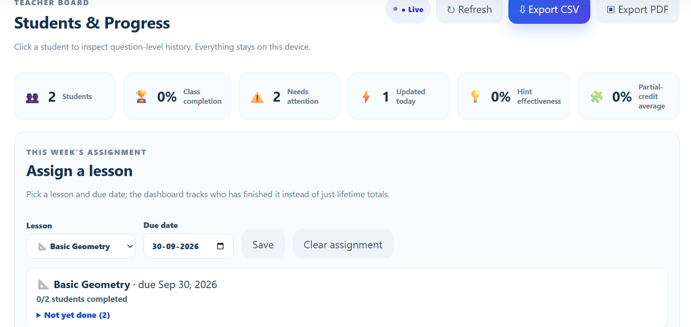

---

## 16. Class Weak-Spots Detection

The application analyses question-level attempt data.

For each question, it can calculate the percentage of students who got the question wrong on their first attempt.

This helps a teacher identify questions that may need whole-class re-teaching.


---

## 17. Topic / Learning Groups

Students can be grouped according to their progress on a selected lesson:

- Not started
- Needs help
- On track
- Advanced

This allows the teacher to identify students who may benefit from focused practice.


---

## 18. Assignments and Homework Tracking

A teacher can select a lesson as an assignment and optionally provide a due date.

The system can display:

- Assigned lesson
- Completion count
- Remaining students
- Overdue status
- Student homework banner

Assignment settings are stored locally.

---

## 19. Live Teacher Board

OfflineOrbit uses the browser's **BroadcastChannel API** for same-device updates.

When a student saves progress:

```text
Student Tab
    ↓
IndexedDB
    ↓
BroadcastChannel
    ↓
Teacher Tab
    ↓
Refresh analytics
```

This does **not** provide cross-device real-time synchronization.

It is specifically scoped to multiple tabs on the same physical device/browser.

---

## 20. Raise-Hand / "I'm Stuck"

Each quiz question can provide an **I'm Stuck** signal.

When a student raises their hand, the Teacher Board can display:

- Student
- Class
- Lesson
- Question number
- Question text

The signal can be resolved by the teacher or automatically cleared when the question is answered correctly.

---

## 21. CSV and PDF Export

Teachers can export classroom information without a backend.

### CSV

The application generates a CSV file in the browser using:

```text
Blob
+
temporary download link
```

### PDF

The application generates a printable report and uses:

```text
window.print()
```

to allow the browser to save the report as PDF.

---

## 22. Backup, Restore and Merge

Because the core application stores progress locally, data safety is important.

OfflineOrbit provides a file-based backup workflow.

### Backup

All progress records are exported to a JSON file.

Example:

```text
offlineorbit-backup-YYYY-MM-DD.json
```

### Restore

The application validates the backup and merges records.

The normal merge rule is:

```text
newer timestamp wins
```

This helps prevent an older backup from unintentionally replacing newer progress.

---

## 23. Optional Online Sync

Internet connectivity is optional.

When connectivity is available, a teacher can explicitly use:

**Sync now**

The application can POST unsynced records to a configured HTTP endpoint.

A possible target is:

```text
School HTTP endpoint
        or
Google Apps Script + Google Sheet
```

The core learning experience does not depend on this feature.

---

## 24. Accessibility Suite

OfflineOrbit includes:

- Larger touch targets
- High-contrast theme
- Dyslexia-friendly reading mode
- Read-aloud support
- ARIA state attributes

Accessibility settings are stored locally and reapplied when the application is loaded.


---

# Screenshots

## Login


## Syllabus


## Interactive Lesson


## Quiz


## Student Dashboard


## Teacher Board


## Weak Spots


## Topic Groups and Data Safety


---

# System Architecture

OfflineOrbit follows an **offline-first, local-first, client-only SPA architecture**.

The project does not use a conventional:

```text
Frontend → API → Server → Database
```

architecture for its core learning loop.

Instead:

```text
Browser
   ↓
Application Shell
   ↓
Lesson Runtime
   ↓
IndexedDB
   ↓
Student / Teacher Analytics
```

The only network boundary is the explicitly triggered optional sync operation.

## Architecture Diagram

The following diagram is taken from the **System Architecture Model** in the project report and included here as the project's architecture reference.


The report describes the architecture as consisting of:

- Presentation / Shell
- Content / Interactivity
- Analytics / Dashboard
- Data / Persistence
- Cross-tab Signaling
- Offline Infrastructure
- Optional Remote Layer

---

# Technology Stack

| Layer | Technology | Purpose |
|---|---|---|
| Build / Dev Server | Vite 5.4 | Development server and build |
| Language | Vanilla JavaScript / ES Modules | Lightweight application logic |
| Markup | HTML5 | Lessons and application shell |
| Styling | CSS3 | Responsive UI and accessibility modes |
| Application Architecture | Lightweight SPA + Hash Router | Client-side navigation |
| Offline Cache | Service Worker + Cache API | Offline application shell |
| Database | IndexedDB | Student progress persistence |
| Small Settings | localStorage | Session/settings/assignment data |
| Cross-tab Communication | BroadcastChannel | Live same-device updates |
| Speech | Web Speech API | Offline read-aloud |
| Installability | Web App Manifest | PWA installation |
| Export | Blob + browser download | CSV export |
| PDF | Native browser print | PDF generation |
| Optional Sync | Fetch API / POST | Explicit remote synchronization |

The project deliberately avoids a large frontend framework. The report explains that a framework runtime would add additional assets to download and cache, which is undesirable for the low-bandwidth and low-specification devices targeted by OfflineOrbit.

---

# Application Flow

## Student Flow

```text
Open OfflineOrbit
       ↓
Login with Name + Class ID
       ↓
Student Identity stored locally
       ↓
Syllabus
       ↓
Select Lesson
       ↓
Learn
       ↓
Attempt Quiz
       ↓
Wrong → Hint / Retry
       ↓
Correct → Score Saved
       ↓
Progress Dashboard
       ↓
Leaderboard / Review / Homework
```

## Teacher Flow

```text
Login as "teacher"
       ↓
Teacher Board
       ↓
Read IndexedDB class records
       ↓
┌──────────────┬──────────────┬───────────────┐
│ Student Data │ Weak Spots   │ Topic Groups  │
├──────────────┼──────────────┼───────────────┤
│ Assignments  │ Raised Hands │ Leaderboard   │
├──────────────┼──────────────┼───────────────┤
│ CSV/PDF      │ Backup       │ Restore/Sync  │
└──────────────┴──────────────┴───────────────┘
```

---

# Data Model

The central IndexedDB object store is the `progress` store.

Each progress record uses a composite key:

```text
studentId::lessonId
```

### Core fields

| Field | Type | Purpose |
|---|---|---|
| `key` | string | Composite primary key |
| `studentId` | string | Student identity |
| `lessonId` | string | Lesson identifier |
| `completed` | boolean | Whether the lesson is completed |
| `score` | number | Lesson score |
| `attempts` | number | Total attempts |
| `questionAttempts` | object | Per-question attempt data |
| `questionDetails` | object | Hints, wrong choices and effectiveness |
| `timestamp` | ISO string | Last-write timestamp |
| `synced` | boolean | Optional sync state |

Lesson IDs in the documented model include:

```text
l1
l2
l3
s1
s2
```

---

# Project Structure

The architecture described in the project report follows this organization:

```text
OfflineOrbit/
│
├── index.html
├── manifest.json
├── service-worker.js
│
├── public/
│   └── lessons/
│       ├── *.html
│       └── lesson assets
│
└── src/
    ├── app-shell.js
    ├── router.js
    ├── syllabus-view.js
    │
    ├── lessons/
    │   └── lesson-runtime.js
    │
    ├── dashboard/
    │   └── dashboard.js
    │
    └── shared/
        ├── db.js
        └── live-signal.js
```

### Main modules

| Module | Responsibility |
|---|---|
| `app-shell.js` | Login, navigation and application shell |
| `router.js` | Hash-based client-side routing |
| `syllabus-view.js` | Lesson catalogue |
| `lesson-runtime.js` | Lesson rendering, quizzes, hints, TTS, review and worksheets |
| `dashboard.js` | Student dashboard, leaderboard and Teacher Board |
| `db.js` | IndexedDB access, backup, restore and sync |
| `live-signal.js` | BroadcastChannel live updates |
| `service-worker.js` | Offline caching |
| `manifest.json` | PWA installation metadata |

---

# Offline-First Design

OfflineOrbit follows these principles:

### 1. Offline is the default

The core learning loop does not require an internet connection.

### 2. No backend for core functionality

The browser provides the required storage and messaging APIs.

### 3. Local data is the source of truth

Student progress is stored in IndexedDB.

### 4. Network is optional

Network access is used for:

- Initial installation/load
- Refreshing cached assets
- Explicit optional sync

### 5. Honest feature boundaries

The live Teacher Board is intentionally documented as **same-device only**. Cross-device real-time communication would require an additional server or synchronization layer.

---

# Student Experience

A student can:

1. Log in using name and class ID.
2. Select English or Hindi.
3. Browse the syllabus.
4. Open an interactive lesson.
5. Read or listen to the lesson.
6. Attempt questions.
7. Use hints.
8. Retry incorrect questions.
9. Receive partial credit based on attempts.
10. Review questions that required extra attempts.
11. View personal progress.
12. View the classroom leaderboard.
13. Complete assigned homework.
14. Raise an "I'm Stuck" signal when needed.
15. Print a practice worksheet.

---

# Teacher Experience

A teacher can:

1. Log in using the teacher identity.
2. View class progress.
3. Inspect student × lesson results.
4. Identify weak questions.
5. Group students by learning status.
6. Assign a lesson.
7. Track assignment completion.
8. Receive same-device raised-hand signals.
9. Monitor hint effectiveness.
10. Export class data.
11. Back up student progress.
12. Restore progress after a device reset.
13. Optionally sync records when internet is available.

---

# Data Safety and Backup

A shared classroom device creates a practical data-loss risk.

Possible causes include:

- Browser data being cleared
- Device reset
- Tablet replacement
- Browser profile changes

OfflineOrbit addresses this using portable JSON backups.

Recommended classroom workflow:

```text
Use OfflineOrbit
      ↓
Progress accumulates locally
      ↓
Teacher opens Data Safety
      ↓
Export Backup
      ↓
Save JSON to USB / shared drive / other safe location
      ↓
Restore if the device is reset
```

---

# Optional Online Sync

The optional sync layer is deliberately separated from the offline core.

```text
IndexedDB
    ↓
Unsynced records
    ↓
Teacher selects "Sync now"
    ↓
HTTP POST
    ↓
Configured endpoint
```

Only an explicit successful HTTP 2xx response marks the sent records as synchronized.

This means a failed sync is not silently treated as successful.

---

# Accessibility

OfflineOrbit provides accessibility controls directly in the application.

### Larger touch targets

Useful for:

- Shared tablets
- Young learners
- Touch interfaces

### High contrast

Improves visual separation of text and controls.

### Dyslexia-friendly mode

Uses a more readable system-font configuration with additional spacing.

### Read-aloud

Provides English/Hindi speech through the browser's SpeechSynthesis API.

---

# Lessons Included

The documented Class 4 prototype contains five lessons.

| Subject | Lesson |
|---|---|
| Mathematics | Whole Numbers |
| Mathematics | Fractions |
| Mathematics | Basic Geometry |
| EVS / Science | Plants Around Us |
| EVS / Science | States of Matter |

The lesson format is designed so that additional bilingual HTML lesson fragments can be added without changing the application's core architecture.

---

# Installation and Running

The documented development setup uses **Vite**.

### Prerequisites

- Node.js
- npm
- A modern browser with support for the browser APIs used by the project

### Install dependencies

```bash
npm install
```

### Start development server

```bash
npm run dev
```

The report also documents a Windows `start.bat` option for simpler local setup.

---

# Build and Deployment

Create a production build with:

```bash
npm run build
```

The resulting static application can be hosted using a static file server.

OfflineOrbit does not require:

- A cloud database
- A dedicated backend
- Server-side authentication
- A paid hosting service for its core offline operation

It can also be used locally on a Windows machine according to the documented project setup.

---

# Architecture Decisions

## Why Vanilla JavaScript?

The application targets low-specification and low-connectivity environments.

Using Vanilla JavaScript:

- Reduces runtime overhead
- Reduces the number of assets that must be cached
- Avoids a framework runtime dependency
- Keeps the application portable
- Fits the relatively small SPA shell

---

## Why IndexedDB?

`localStorage` is useful for small settings, but student progress is structured data with multiple records and fields.

IndexedDB provides:

- Structured storage
- Indexed records
- Persistent browser storage
- More capacity than the small text-oriented localStorage model

---

## Why BroadcastChannel?

BroadcastChannel provides native same-device tab communication.

This makes it possible to update a Teacher Board when another tab saves student progress without introducing a server.

---

## Why Web Speech API?

The browser can generate speech without requiring:

- Audio files
- A TTS server
- An external API

This is especially useful for an offline learning application.

---

# Limitations

OfflineOrbit is intentionally scoped.

### 1. Device-local progress

Progress is primarily tied to the browser storage of the physical device.

Moving a student to another device normally requires backup/restore or optional sync.

### 2. Same-device live updates

The live Teacher Board works across tabs on the same device/browser environment.

It is **not** cross-device real-time synchronization.

### 3. Limited current content

The current documented prototype contains five Class 4 lessons:

- 3 Mathematics
- 2 EVS / Science

### 4. Identity-less login

The login system is intentionally lightweight and does not provide server-side identity verification.

### 5. Optional sync requires configuration

Cross-device/off-device copies require an explicitly configured HTTP endpoint.

---

# Future Extensions

Possible extensions that fit the existing architecture include:

- More Class 4 lessons
- Additional grade levels
- Additional Indian languages
- More science and mathematics content
- More detailed teacher reports
- Cross-device synchronization
- School-wide dashboards
- Centralized authentication when infrastructure permits
- More advanced learning analytics
- Additional accessibility controls
- Expanded question banks
- More assignment types
- More export formats

The offline core can remain the foundation while additional remote functionality is added as an optional layer.

---

# Feasibility and Viability

## Technical Feasibility

The documented implementation uses standard browser APIs including:

- Service Worker
- IndexedDB
- BroadcastChannel
- SpeechSynthesis
- Fetch
- Blob
- Web App Manifest

The dependency footprint is intentionally small.

---

## Operational Feasibility

The core application does not require:

- Server provisioning
- Database administration
- Cloud uptime monitoring
- Account provisioning

Teachers can operate the learning and data-safety workflow from the same device.

---

## Economic Feasibility

The core offline experience has no recurring backend, database or licensing infrastructure requirement.

It is designed to run on existing shared laptops/tablets.

---

## Adoption Considerations

The project is designed around:

- Simple name + class login
- English/Hindi content
- Minimal teacher data entry
- Offline operation
- Low infrastructure requirements
- Built-in backup and restore

---

# Benefits

| Stakeholder | Benefit |
|---|---|
| Students | Offline learning, bilingual content, hints, retries, read-aloud and progress |
| Students needing additional support | Review mode, partial credit and "I'm Stuck" signalling |
| Teachers | Class analytics, weak spots, topic groups, assignments and live same-device updates |
| Schools | Low infrastructure requirements and local data protection |
| Parents | Visibility into completed lessons and scores |
| NGOs / Education Programs | Reusable offline-first architecture that can be extended with more content |

---

# Design Philosophy

OfflineOrbit is based on five core principles:

### Offline first

Connectivity should not determine whether the learning application works.

### Bilingual by construction

English and Hindi content are part of the same lesson system rather than separate applications.

### Local-first data

The browser stores the progress needed for the learning experience.

### Analytics from normal usage

Teacher insights are generated from the same progress data students naturally create while learning.

### Honest scope

Features are documented according to what the architecture actually supports. For example, live updates are explicitly limited to the same physical device.

---

# Conclusion

OfflineOrbit demonstrates a lightweight approach to building an interactive learning platform for classrooms where continuous internet access cannot be assumed.

The architecture combines a PWA shell, Service Worker caching, IndexedDB persistence, native browser messaging, bilingual lesson content, adaptive practice, accessibility features and teacher analytics without requiring a backend for the core learning loop.

The project therefore provides a foundation that can continue working offline while still offering optional synchronization and export when connectivity becomes available.

---

## Reference

This README was prepared using the **OfflineOrbit Project Report** and the supplied prototype screenshots as the primary project references. The architecture diagram included in this repository is taken from the report's **System Architecture Model** section.

